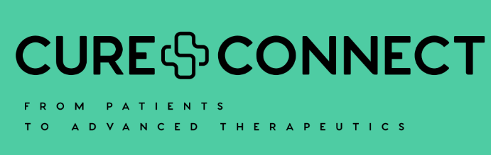

<div align="center">
  
</div>

# Cure-Connect

> LLM-empowered user-friendly searching platform to connect patients to clinical trials.


## 🏥 Overview

Cure-Connect is an innovative healthcare platform that leverages Large Language Models (LLMs) to intelligently match patients with relevant clinical trials. Our user-friendly interface simplifies the complex process of finding suitable clinical trials, making advanced medical research more accessible to patients who need it most.

## 🚀 Features

- **Intelligent Patient Matching**: AI-powered algorithm to match patients with relevant clinical trials
- **User-Friendly Interface**: Intuitive web application built with modern technologies
- **Comprehensive Trial Database**: Access to extensive clinical trial information
- **Interactive Questionnaire**: Dynamic questioning system to gather patient information
- **Real-time Results**: Instant matching and results display

## 🏗️ Architecture

This project follows a modern full-stack architecture:

- **Frontend**: Next.js 14 with React 18, styled with Tailwind CSS and DaisyUI
- **Backend**: Flask-based REST API with Python
- **Data Processing**: Advanced preprocessing pipeline for clinical trial data

## 📁 Project Structure

```
Cure-Connect/
├── backend/                 # Flask API server
│   ├── src/
│   │   ├── api/            # API routes and endpoints
│   │   ├── models/         # Data models
│   │   ├── services/       # Business logic
│   │   └── utils/          # Utility functions
│   ├── data/               # Data files and preprocessing
│   ├── config/             # Configuration files
│   ├── tests/              # Backend tests
│   ├── requirements.txt    # Python dependencies
│   └── run.py             # Application entry point
├── frontend/               # Next.js web application
│   ├── src/app/           # App router pages and components
│   ├── public/            # Static assets
│   └── package.json       # Node.js dependencies
└── docs/                  # Project documentation
```

## 🛠️ Installation & Setup

### Prerequisites

- **Node.js** >= 18.0.0
- **Python** >= 3.8
- **npm** >= 8.0.0

### Backend Setup

1. Navigate to the backend directory:
   ```bash
   cd backend
   ```

2. Create a virtual environment:
   ```bash
   python -m venv venv
   source venv/bin/activate  # On Windows: venv\Scripts\activate
   ```

3. Install dependencies:
   ```bash
   pip install -r requirements.txt
   ```

4. Set up environment variables:
   ```bash
   cp .env.example .env
   # Edit .env with your configuration
   ```

5. Run the backend server:
   ```bash
   python run.py
   ```

The backend will be available at `http://localhost:5000`

### Frontend Setup

1. Navigate to the frontend directory:
   ```bash
   cd frontend
   ```

2. Install dependencies:
   ```bash
   npm install
   ```

3. Run the development server:
   ```bash
   npm run dev
   ```

The frontend will be available at `http://localhost:3000`

## 🚀 Usage

1. Start both the backend and frontend servers
2. Open your browser and navigate to `http://localhost:3000`
3. Complete the patient information form
4. Answer the dynamic questionnaire
5. View your matched clinical trials

## 🧪 Development

### Backend Development

- **API Routes**: Located in `backend/src/api/`
- **Business Logic**: Implemented in `backend/src/services/`
- **Data Models**: Defined in `backend/src/models/`

### Frontend Development

- **Pages**: Located in `frontend/src/app/`
- **Components**: Reusable components in `frontend/src/app/components/`
- **Styling**: Tailwind CSS with DaisyUI components

## 📊 Data

The platform processes clinical trial data stored in the `backend/data/preprocessing/` directory. The data includes:

- Clinical trial information (NSCLC.json)
- Generated client data
- OpenAI processing results
